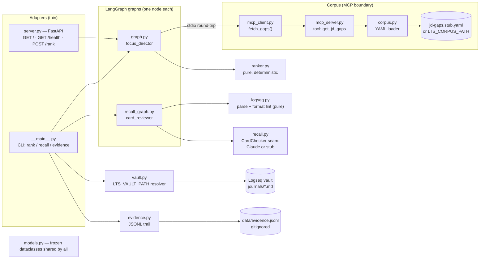

# Development guide — how this repo works, and how to work on it

The architecture, why each technology is here, the seams that keep it
testable, and the workflows for changing, testing, and shipping it. Current
as of **v1.2**.

## The big picture

learn-to-ship is an **output-driven learning agent**, deliberately small:
**two LangGraph graphs, one node each**, plus thin adapters (CLI, HTTP
server, MCP server) and two pure support modules (vault, evidence).

Three principles explain most of the code:

1. **Determinism where possible, LLM only where necessary.** Ranking is a
   pure function; card *format* linting is pure; only card *content*
   judgement uses Claude, behind an injectable seam.
2. **The corpus is read through MCP, never directly** — a spec constraint
   ("consumes an MCP tool" is itself a JD gap this portfolio project closes).
3. **Agent public, career data private.** The committed corpus is fictional;
   the real one arrives via `LTS_CORPUS_PATH`. The hosted deploy serves the
   stub on purpose, stays keyless, and never writes evidence.

## Architecture map



Notes the map can't show: `mcp_client` spawns `mcp_server` as a subprocess of
the same interpreter per fetch (a real MCP initialize → call_tool round-trip);
`server.py` never calls `load_dotenv` and never imports `evidence`, so a
hosted container can only serve the public stub and never logs usage.

## Tech stack — what and why

| Technology | Role | Why this choice |
| --- | --- | --- |
| `uv` | Env + lockfile; every command is `uv run …` | Fast, reproducible (`--frozen` in CI/Docker) |
| LangGraph | `StateGraph` + TypedDict state, compiled `graph` / `recall_graph` | The "shipped agent on a named framework" JD gap is the point; graphs stay thin on purpose |
| MCP SDK | `FastMCP` server exposing `get_jd_gaps`; stdio client | Authentic MCP consumption instead of a fake file read |
| FastAPI + uvicorn | `server.py`: front page + `/health` + `/rank` | Free self-hosted deploy (HF Spaces) vs $39/mo LangGraph Platform |
| langchain-anthropic | `ChatAnthropic` + `with_structured_output` (Pydantic), model `claude-sonnet-5` | Structured output → no response parsing; capable and cheap enough to run often |
| pytest (+asyncio) | Hermetic suite; `live` marker for real-API tests | `addopts = -m 'not live'` keeps CI keyless and offline |
| ruff | Lint + format, line 100, py311 | One tool for both; CI runs `check` and `format --check` |
| GitHub Actions | Lint + full suite (incl. golden eval) on every push/PR | "A failing eval fails the build" is an acceptance criterion |
| Docker → HF Spaces | Port 7860, non-root uid 1000 (Spaces conventions) | Free hosting; live at <https://vegekiwi-learn-to-ship.hf.space> |
| PyYAML / dotenv | YAML data files; `.env` loaded by the CLI only | Human-editable data; secrets never reach the hosted container |

## Repository map

| Path | What it is |
| --- | --- |
| `learn_to_ship/graph.py` | Rank graph; state `{candidates, ranked}`; module-level `graph` is the `langgraph.json` entrypoint |
| `learn_to_ship/ranker.py` | The deterministic core — word-start-anchored keyword match, leverage-first sort, full tie-break chain |
| `learn_to_ship/models.py` | Frozen dataclasses (`Gap`, `StudyItem`, `RankedItem`, `Card`, `CardIssue`, `CardReview`) — testable without LangGraph |
| `learn_to_ship/mcp_server.py` | The *only* module that reads the corpus file |
| `learn_to_ship/mcp_client.py` | `fetch_gaps()` — spawn server, initialize, call tool, parse |
| `learn_to_ship/corpus.py` | YAML load + `LTS_CORPUS_PATH` resolution (relative → repo root); fails loudly |
| `learn_to_ship/recall_graph.py` | Recall graph; state `{cards_text, material, reviews}` |
| `learn_to_ship/logseq.py` | Pure parser + format linter for `#card` blocks (bilingual presence, tags, `#q/*`) |
| `learn_to_ship/recall.py` | The LLM seam: `CardChecker` Protocol, `ClaudeCardChecker`, `StubCardChecker`, `get_checker()` |
| `learn_to_ship/vault.py` | v1.1 — resolve `--today`/`--journal` to `journals/yyyy_MM_dd.md`; expand a directory to card files |
| `learn_to_ship/evidence.py` | v1.2 — append-only JSONL trail; fail-safe writes; `summarize()` ends in the corpus nudge |
| `learn_to_ship/server.py` | FastAPI wrapper (rank only); serves `static/index.html` at `/` |
| `learn_to_ship/static/index.html` | The demo front page — one self-contained file, no build toolchain |
| `learn_to_ship/__main__.py` | CLI (`rank` default, `recall`, `evidence`); loads `.env`; auto-logs usage |
| `data/` | `*.stub.yaml` — fictional, committed (corpus + example candidates) · `*.real.yaml`, `evidence.jsonl` — private, gitignored |
| `evals/cases.yaml` | Golden eval — candidates across every leverage tier + the exact `expected_order` CI pins |
| `tests/` | 46 hermetic tests + 2 `live`-marked |
| `spec.md` / `QUESTIONS.md` / `LOG.md` / `DEPLOY.md` | Scope (source of truth) / demand signals / dated milestones / deploy runbook |

## How a request flows

**rank** — CLI loads `.env`, reads candidates → `focus_director` calls
`fetch_gaps()` (stdio MCP round-trip; the env dict is passed so
`LTS_CORPUS_PATH` reaches the subprocess) → `ranker.rank()` picks per item
the highest-leverage gap whose keyword hits the tags/title at a word start →
sort key `(leverage, hits, freq, index)` → dict output with a one-line
rationale. The CLI then appends a `rank` event to the evidence trail.

**recall** — CLI resolves the target (`--cards` file/dir, or `--today` /
`--journal` via `vault.py`) → `card_reviewer` parses `#card` blocks, runs the
pure format lint plus `get_checker().check()` (Claude if a key is present,
else a no-op stub) → per-card verdicts. The CLI appends a `recall` event per
reviewed file.

**evidence** — no graph: pure bookkeeping. `--item`+`--output` appends an
`output` event; bare `evidence` prints `summarize(read_events())`, which ends
with the corpus-update nudge. Writes are fail-safe (an unwritable trail must
never break ranking).

## The seams that keep it testable

- **Pure ranker** — ordering exercised as plain function calls.
- **MCP boundary** — round-trip tested against the stub corpus.
- **Injectable card checker** — tests monkeypatch `recall.get_checker`;
  the two real-Claude tests are `live`-marked and deselected by default.
- **Pinned env** — `tests/conftest.py` deletes `LTS_CORPUS_PATH` and
  `LTS_VAULT_PATH` and points `LTS_EVIDENCE_PATH` at a per-test tmp file, so
  no test can read your real data or append to your real trail.
- **Golden eval** — `test_eval_harness.py` runs the *compiled graph* (MCP
  fetch included) and asserts the exact order plus invariants.

## Daily workflow

```bash
uv sync                                   # once
uv run pytest                             # hermetic suite (~4s)
uv run ruff check . && uv run ruff format .
uv run pytest -m live                     # real-Claude checks (needs key)
uv run uvicorn learn_to_ship.server:app --port 7860   # front page + API
uv run langgraph dev                      # LangGraph dev server (:2024)
docker build -t learn-to-ship . && docker run --rm -p 7860:7860 learn-to-ship
```

CI mirrors lint + `pytest -q` exactly; green locally means green in CI.

## Making changes — the established rhythm

Product changes follow the trail this repo has used since v1.1:

1. A need shows up in dogfooding → record it in **`QUESTIONS.md`** (what was
   asked, underlying need, design implication as hypothesis, status).
2. If it should change scope, discuss → amend **`spec.md`** (non-goals get
   amended, not silently crossed).
3. Build on a feature branch; every expensive dependency goes behind a seam;
   verify end-to-end (real vault, real browser, real endpoint — not tests
   alone).
4. Ship: PR → merge → **`LOG.md` entry + annotated git tag `vX.Y`** on the
   milestone merge commit.

Mechanical recipes:

- **Ranking behavior**: edit `ranker.py`; if the golden order changes
  *intentionally*, update `evals/cases.yaml` in the same commit and say why.
- **Corpus schema**: change `Gap.from_dict`, the stub fixture, and your real
  corpus together; the MCP tool serializes `Gap.__dict__`, so fields flow.
- **Card checks**: structure → `logseq.lint_format()` (+test); content
  judgement → the system prompt in `recall.py`.
- **New node/graph**: TypedDict state, `build_*_graph()` factory, module-level
  compiled instance, register in `langgraph.json` — check `spec.md` first.
- **Deploy update**: merge to `main` (CI green) → HF Space → Settings →
  Factory rebuild (its Dockerfile clones this repo at build time) → check
  `https://vegekiwi-learn-to-ship.hf.space/`. Runbook: `DEPLOY.md`.

## Guardrails (non-negotiable)

- **Never commit career data.** Real corpus outside the repo via
  `LTS_CORPUS_PATH`; `.env` and real data gitignored *and* dockerignored;
  `server.py` never loads `.env`. Never set `LTS_CORPUS_PATH` on a hosted
  deploy.
- **`spec.md` is the source of truth for scope**; `QUESTIONS.md` records
  demand, decisions land in spec.
- **The agent advises and reports; the human learns, authors, and updates
  the corpus.** No card generation, no capture, no automatic corpus edits.
- **Keep CI hermetic** — anything needing a key or network goes behind a seam
  and a `live` marker.
- Conventional commits; small single-purpose modules; type hints on public
  functions; docstrings state intent.

---

*Companion: [USAGE.md](USAGE.md). Docs regenerated 2026-07-08 at v1.2.*
