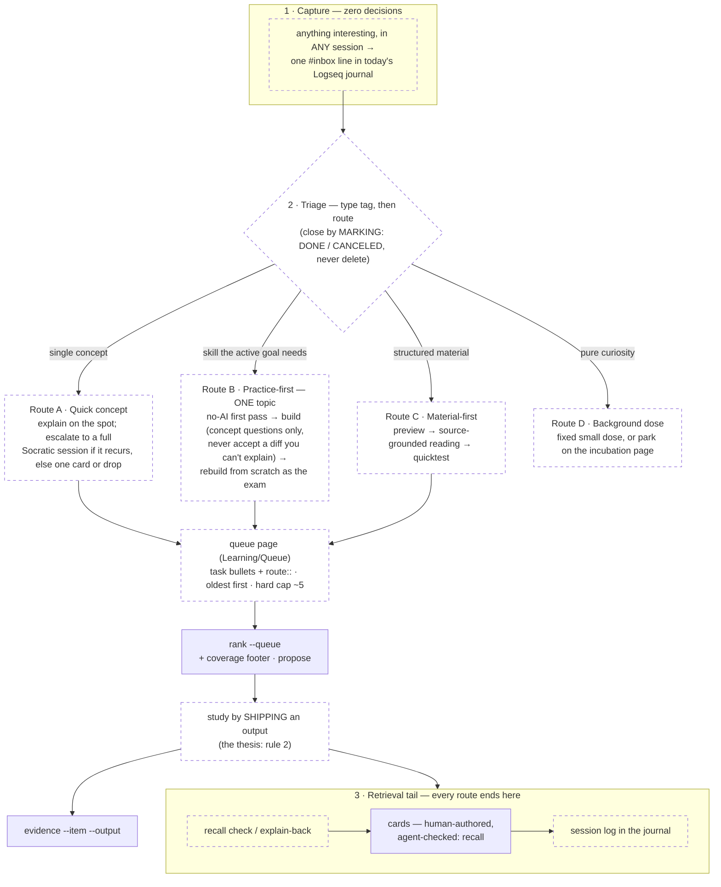

# The learning loop — the human system this agent serves

learn-to-ship is the deployable-agent form of a **human learning loop that
predates it**. The agent enters that loop at defined points and never owns it.
This page describes the loop itself — the stages, the routes, the rules — so
anyone working on this project (or any AI session inside it) knows the system
around the tool, not just the tool. Day-to-day commands live in
[USAGE.md](USAGE.md); this page is the *why* behind their boundaries.

The canonical sources are private (the Logseq vault's conventions page and the
owner's workflow inventory); this page is the project-facing mirror. On drift,
those win — fix this file, never the loop.

## The three rules

Every design decision in this repo traces back to one of these.

1. **Attention is all I need.** One practice topic at a time. Capture is
   zero-decision so working attention is never broken; triage exists to
   protect attention, not to fill a backlog — hence the queue's hard cap.
2. **Output is the only thing that matters — and only output I generated.**
   Every practice cycle ends in an artifact: a repo, a deploy, a post.
   AI-*delegated* output produces near-zero learning (see the evidence
   below), so the AI explains and critiques; the human writes the thing
   being learned.
3. **Retrieval is the studying.** Reading and watching are prep. The rebuild,
   the quicktest, the explain-back, the cards — *that* is the studying, and
   no route skips the retrieval tail.

## The loop

Dashed boxes are human-owned — permanently, by design, not as a v0 gap.
Solid boxes are where this agent operates.

### 1 · Capture — zero decisions (human, always)

Anything interesting — a term, a topic, an itch — becomes one `#inbox` line in
today's Logseq journal, from any session. No routing decision at capture time;
that is what keeps rule 1 intact. **Hard boundary:** the agent never writes
capture lines (spec.md Non-Goals — this predates the project and will outlive
it).

### 2 · Triage — when picking what to work on (human, always)

Triage adds a type tag (`#learn` / `#idea` / `#thought` / `#mood`) and closes
lines by **marking, not deleting** — `DONE` keeps history; `CANCELED` is
reserved for genuine noise. `#learn` lines pick a route:

- **Route A · Quick concept** — explain on the spot; a concept that keeps
  recurring escalates to a full Socratic learn session; otherwise one card,
  or drop it.
- **Route B · Practice-first** — the main lane, one topic at a time: a no-AI
  first pass (sketch the solution unaided; the delta is a personal gap
  report), then build with AI answering *concept questions only* — the human
  writes the learning-target code and never accepts a diff they can't
  explain — then rebuild from scratch as the exam; stuck points are the real
  gaps, each studied properly.
- **Route C · Material-first** — for structured material (a course, a book,
  a paper): preview summary → source-grounded reading Q&A → quicktest.
- **Route D · Background dose** — pure curiosity: a fixed small dose with no
  project and no deliverable, or park it on the incubation page.

Routes A–C land as task-marked bullets on the queue page
(`[[Learning/Queue]]`, `route::` property, oldest first, **hard cap ~5** —
kill one before adding one). Route D parks on `[[Learning/Incubation]]`.

### 3 · Retrieval tail — every route ends here

Recall check / explain-back (the AI plays the naive student and asks why) →
flashcards → a session log in the journal. Cards are **human-gated**: the
human picks what deserves a card and phrases it — an LLM-written card is one
you won't remember. That is exactly why this repo's v1 is a card *checker*
and not a generator.

## Where this agent plugs in

| Loop point | Agent feature | Boundary held |
|---|---|---|
| Triaged queue | `rank --queue` reads the queue page | read-only; capture and triage stay human |
| Queue blind spots | coverage footer + `propose --queue [--write]` | drafts are pre-triage: `--write` appends them to `[[inbox/propose]]` (the one page the agent may write, append-only); the human routes A–D |
| The output | `evidence --item --output` + the trail | the human records and updates the corpus; the agent only nudges |
| The cards | `recall` — format, complexity, correctness | critiques only; never writes or generates a card |

One line: **the human owns capture, triage, the study itself, the output, and
the cards; the agent ranks, proposes, critiques, and reports.** Advise at
entry, never decide.

## Why the loop is shaped this way (evidence)

- **Concept-questions-only + explain-before-accept** — an Anthropic RCT on 52
  junior engineers ([infoq.com/news/2026/02/ai-coding-skill-formation](https://www.infoq.com/news/2026/02/ai-coding-skill-formation)):
  code-delegators scored <40% comprehension vs 65%+ for concept-askers; the
  small speed gain from delegating isn't worth the collapse.
- **No-AI first pass** — sketch unaided, then let AI challenge; the delta is
  a personalized gap report.
- **Socratic tutoring** — Mollick & Mollick's tutor prompts
  ([moreusefulthings.com/prompts](https://www.moreusefulthings.com/prompts)):
  no direct answers, one question at a time, hints not solutions.
- **Human-gated cards** — Matuschak
  ([andymatuschak.org/prompts](https://andymatuschak.org/prompts)): LLMs lack
  the taste to pick deck-worthy cards and fail at conceptual ones; the human
  selects and edits everything.
