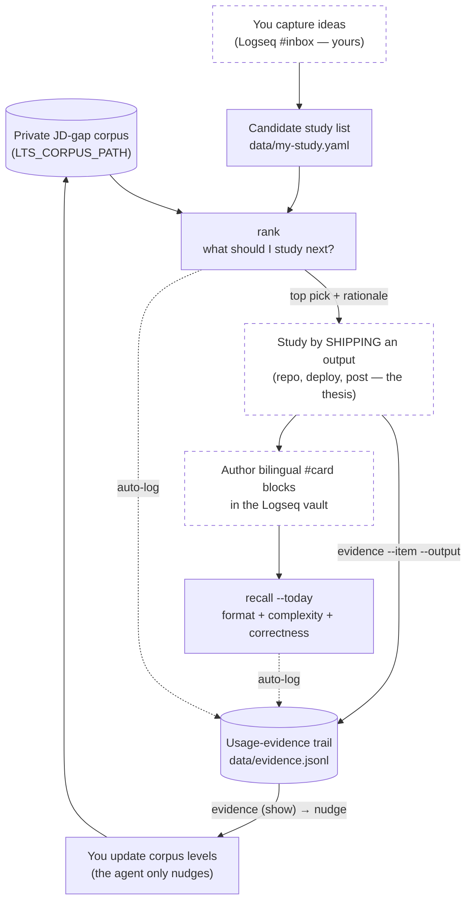

# Usage guide — learn-to-ship day to day

Three commands. **rank** tells you what to study next, ranked by which
job-description gap each item unblocks. **recall** checks the flashcards you
wrote afterwards. **evidence** shows the trail that links the two. You capture
and you author; the agent ranks, critiques, and reports — never more.

## The atlas — how one loop hangs together

The agent touches the loop at three points (solid boxes); the middle belongs
to you. Dotted arrows are automatic — they happen just because you use the
tool.



### The weekly rhythm, as a checklist

1. **Capture** study ideas yourself in Logseq `#inbox` — the agent never does.
2. **Transfer** real candidates into `data/my-study.yaml` (gitignored).
3. **Rank**: `uv run python -m learn_to_ship` — study the top item; the
   rationale says which gap it closes and why it's worth it. (Auto-logged.)
4. **Ship an output** for it — that's the studying, per the project thesis.
5. **Record it**: `evidence --item <id> --output <url>`.
6. **Author cards** on what you learned, bilingual, in your vault.
7. **Check them**: `recall --today` — fix what it flags. (Auto-logged.)
8. **Review the trail** every week or two: `evidence` — items with shipped
   outputs are your cue to raise `level` / lower `leverage` in the corpus, so
   next week's ranking reflects reality. The update is yours to make.

## One-time setup

```bash
git clone https://github.com/canglang-social/learn-to-ship.git
cd learn-to-ship
uv sync
cp .env.example .env
```

Then edit `.env` (gitignored — nothing here is ever committed):

```bash
# Your REAL, private JD-gap corpus. Unset = the public fictional stub.
LTS_CORPUS_PATH=../job_hunting/data/jd-gaps.real.yaml

# Your Logseq vault root (the folder that contains journals/) — read-only.
LTS_VAULT_PATH=/Users/you/path/to/vault

# Only for recall's complexity + correctness checks (rank never uses it):
ANTHROPIC_API_KEY=sk-ant-...
```

Everything still works without a `.env`: rank uses the committed demo corpus,
recall runs format checks only, and evidence logs to the default gitignored
path. That's the right mode for trying it out.

## rank — what should I study next?

Keep a candidate list as plain YAML (`data/my-study.yaml`, gitignored). You
capture; the agent picks up *after* capture:

```yaml
candidates:
  - id: k8s-deploy
    title: Containerize a service and deploy it to Kubernetes
    tags: [docker, kubernetes, deploy]
```

```bash
uv run python -m learn_to_ship                                  # example list
uv run python -m learn_to_ship --candidates data/my-study.yaml  # your list
uv run python -m learn_to_ship --candidates data/my-study.yaml --json
```

Reading the output:

- **Score = the gap's closing-leverage** (0–1): how much closing that gap
  advances the job hunt, already folding JD frequency × your distance from
  the required level.
- **The rationale states the stakes**: *"gap #N to close"* → study it;
  *"not a top gap"* / *"already a strength"* → matched, but low payoff;
  *"No JD gap matched"* (0.00) → the corpus doesn't price it at all.
- **Matching is literal and word-anchored** (`deploy` matches "deployment";
  `ci` cannot match inside "tra**ci**ng"). If a ranking surprises you, compare
  the item's `tags` against the gap's `keywords` in your corpus — misses are
  visible, never silent.
- **Deterministic**: same input, same order, always. If the order moved, your
  data moved.

Corpus format: a `gaps:` list of `id, competency, freq (0–1), level
(strong|solid|partial|gap|route_around|edge), priority (ladder slot or null),
leverage (0–1, the sort key), keywords (lowercase)`. Copy from the commented
demo `data/jd-gaps.stub.yaml`.

## recall — check the flashcards you wrote

You author the cards — phrasing them **is** the studying, so the tool never
writes or rewrites one. Canonical block (tab-indented answer under the
question):

```text
- Why rank by leverage, not JD frequency? 为什么按 leverage 而非 JD 频率排序？ #card #lts #lts/ranking #q/why
	- Leverage folds frequency × distance-from-level. Leverage 综合频率×水平差距。
```

Anatomy: bilingual question → `#card` → `#<topic>` → `#<topic>/<subtopic>` →
one of `#q/why #q/how #q/apply`; bilingual answer bullet. Logseq `id::`
property lines between them are fine.

```bash
uv run python -m learn_to_ship recall --today             # today's journal
uv run python -m learn_to_ship recall --journal 2026-07-07
uv run python -m learn_to_ship recall --cards path/to/file-or-directory
uv run python -m learn_to_ship recall --today --material notes/langgraph.md
```

| Check | Engine | Flags |
| --- | --- | --- |
| `format` | Deterministic lint — always runs, free | Missing EN or 中文 half, missing answer bullet, front not a question, missing topic tags, invalid `#q/*` |
| `complexity` | Claude (needs key) — severity ⚠ | More than one atomic idea per card; says what to split out |
| `correctness` | Claude (needs key) — severity ✗ | Answer wrong, or unsupported by `--material` when given (always pass the source when you have it) |

Local-only: recall needs your key, so the hosted deploy stays rank-only.

## evidence — the loop, made visible

`rank` and `recall` auto-log to a **private, gitignored** JSONL trail
(`data/evidence.jsonl`; override `LTS_EVIDENCE_PATH`). You add the one thing
only you know — the output you shipped:

```bash
uv run python -m learn_to_ship evidence --item k8s-deploy \
  --output https://github.com/you/thing --note "deployed with health check"

uv run python -m learn_to_ship evidence      # show the trail
```

The summary ends with the corpus-update nudge — the list of items with
shipped outputs whose `level`/`leverage` you should reconsider. The agent
never edits the corpus itself.

## The hosted demo

<https://vegekiwi-learn-to-ship.hf.space> — open in a browser: edit a study
list, click **Rank my list**, see scores and rationales. It serves the
*fictional demo corpus only* (private data never reaches a hosted service),
so it's for demos, not daily ranking. API: `GET /health`, `POST /rank`.

## Troubleshooting

| Symptom | Cause & fix |
| --- | --- |
| `(no ANTHROPIC_API_KEY — format checks only…)` | Expected without a key; set it in `.env` for content checks. |
| `error: LTS_VAULT_PATH is not set` | `--today`/`--journal` need the vault root in `.env`. |
| `error: no journal for 2026-… at …` | No journal file that day — Logseq names them `yyyy_MM_dd.md`. |
| `FileNotFoundError: JD-gap corpus not found` | `LTS_CORPUS_PATH` points at a missing file; relative paths resolve against the **repo root**. |
| `No #card blocks found.` | No bullet carries a whole-word `#card` tag (`#card-group` is deliberately ignored). |
| Item ranks lower than expected | Keyword miss — word-start anchoring; align item `tags` with the gap's `keywords`. |
| Everything scores 0.00 on your real list | You're ranking against the stub — set `LTS_CORPUS_PATH`. |

---

*Companion: [DEVELOPMENT.md](DEVELOPMENT.md). Docs regenerated 2026-07-08 at
v1.2; if behavior and docs disagree, trust the code and open an issue.*
